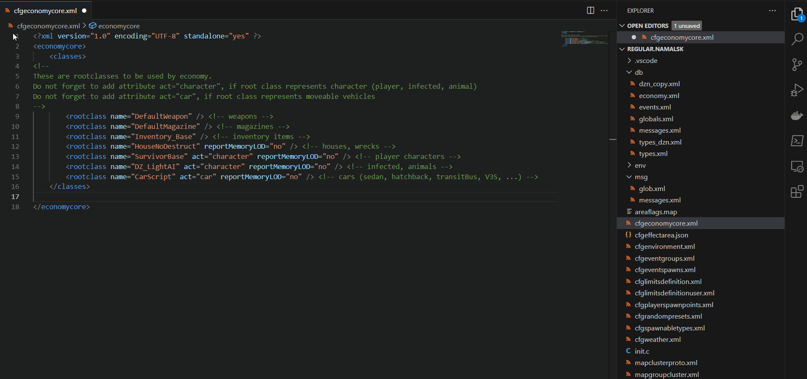
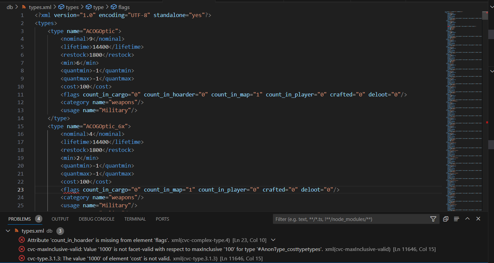
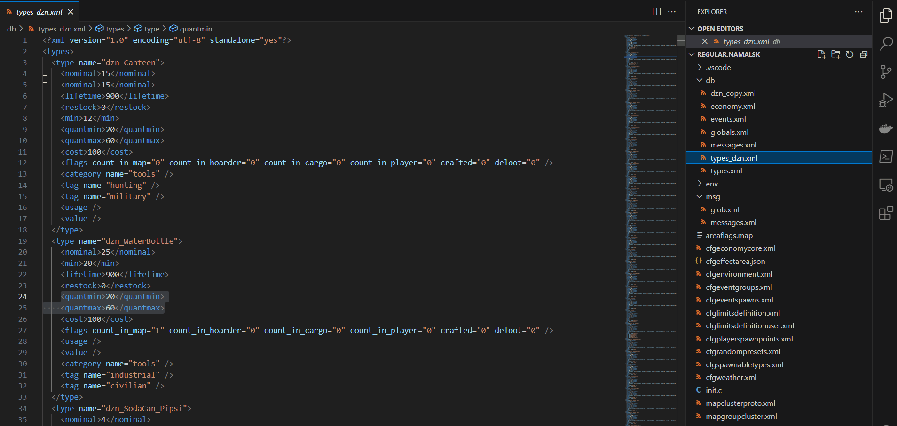
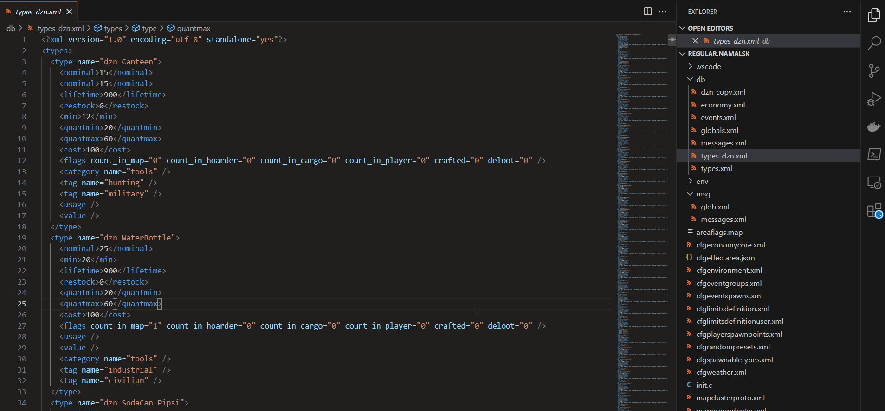

# DayZ CE Schema for VS Code

This extension provides a streamlined way to consume the [DayZ Central Economy Schema](https://github.com/rvost/DayZ-Central-Economy-Schema/) and makes editing the XML configuration a little less tedious.

The extension automatically configures the [XML extension](https://marketplace.visualstudio.com/items?itemName=redhat.vscode-xml) for any workspace that resembles a DayZ server mission folder, so you get validation without any action required.

## Features

The extension automatically configures schema association for CE files (both XML and JSON), providing the following benefits:

- Autocompletion;
  
- Validation;
  
- Tooltips on hover (WIP).
  

If you have questions the extension can provide help on the active file:

### Planed features

- Make validation context aware (e.g. you can't use flags that are not defined in `cfglimitsdefinition.xml`)
- Provide full project validation.

## Requirements

This extension relies on the [XML extension](https://marketplace.visualstudio.com/items?itemName=redhat.vscode-xml) for schema validation, so make sure you have this installed.

## Known Issues

Only open files can be validated. You won't get any validation errors until you open the file in the editor.

Schemas for modded files aren't bound automatically.
If you added new files in `cfgeconomycore.xml` you need to run `Update modded files associations` command from palette to update schema associations.

## Release Notes

### 0.2.0

- Added schema associations for modded CE files.
- Added context aware documentation.

### 0.1.0

Initial release of the extension.

- Added schema association on activation for standard CE files.
