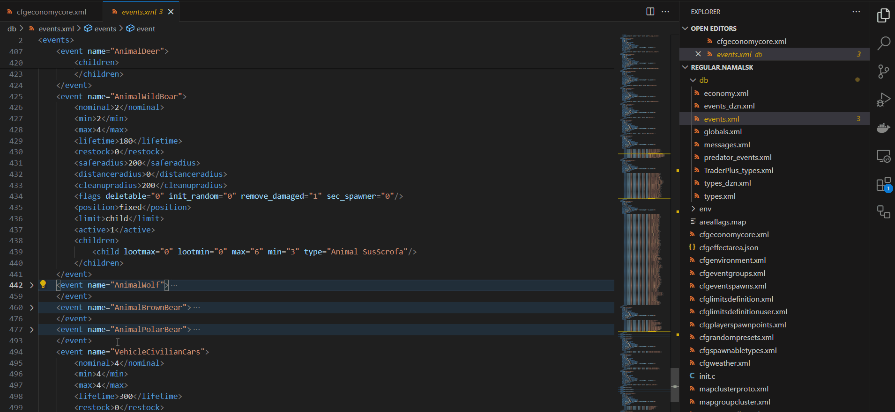

# DayZ CE Schema for VS Code

DayZ Central Economy mission files modding made easy!

This extension aims to provide accurate validation that not only detects broken XML (the only type of error that online validators can detect), but also checks for DayZ-specific schema compliance and semantic errors such as referencing non-existent files, spelling errors in flag names and other referenced values, and so on.
It also provides context sensitive auto-completion to make typing those lengthy classnames faster and less error-prone.
As you would expect from a modern editor, the extension provides code actions to automate common tasks and encourage good habits (such as file splitting).
And other useful features such as tooltips and the "Open Documentation" command.

Happy editing!

> If you found this extension helpful, please consider [starring ⭐the repository](https://github.com/rvost/dayz-ce-schema/stargazers) on Github or rating (or reviewing) it on marketplaces ([[1]](https://marketplace.visualstudio.com/items?itemName=rvost.dayz-ce-schema&ssr=false#review-details), [[2]](https://open-vsx.org/extension/rvost/dayz-ce-schema/reviews)).

## Features

### Autocompletion

### Validation

### Code Actions (WIP)

### Tooltips on hover (WIP)

### Documentation:

### Snippets

The following snippets are currently available:

- `typ` - type snippet for `types.xml`, including all elements except `tag`;
- `evn` - event snippet for `events.xml`;
- `msg-d` - message snippet with a deadline;
- `msg-r` - repeating message snippet;
- `msg-c` - on connection message snippet;
- `spwn-a` - spawnable type with attachment snippet;
- `spwn-c` - spawnable type with cargo snippet;
- `spwn-p` - spawnable type with preset snippet;
- `ldt-s` - loadout slot snippet for spawning gear configuration;
- `ldt-i` - loadout item snippet for spawning gear configuration.

### Planed features

- Provide full project validation.
- Provide quick fixes for common validation errors.
- More code actions for day-to-day task automation.
- One-click navigation to symbols (e.g. to the preset referenced in `cfgspawnabletypes.xml`).
- Classnames auto-completion in JSON files

## Requirements

**This extension requires [Java](https://www.java.com/)** (17 or newer), so make sure you have this installed.

It also relies on the [XML extension](https://marketplace.visualstudio.com/items?itemName=redhat.vscode-xml) for schema validation, but this can be installed automatically if you don't have it.

## Known Issues

- Only open files can be validated. You won't get any validation errors until you open the file in the editor.

- Completion and validation for Object Spawner custom lists currently only works  for json files in the `objectSpawners` folder.
For example, the `objectSpawners/nwaf.json` file will have completion and validation according to the [Object Spawner](https://community.bistudio.com/wiki?title=DayZ%3AObject_Spawner) rules, but `custom/berezino.json` or `altartrader.json` will not.
*This is due to limitations of the VS Code JSON Schema API and may be resolved in the future.* 

- Completion and validation for Spawning Gear Configuration currently only works for json files in the `spawnPresets` folder **or** files which name ends with `_loadout` (e.g. `deathmatch_loadout.json`).

- Fragments inserted by code actions may not be formatted correctly. You can easily fix this with auto-formatting (`Shift+Alt+F` by default).

## Related projects

The DayZ CE Schema extension focuses on direct XML (and JSON) file editing. 
If you prefer a more high-level Excel-like approach, you may be interested in my [DayzServerTools](https://github.com/rvost/DayzServerTools) or Shawminator's [DayZeEditor](https://github.com/Shawminator/DayZeEditor). Both are standalone Windows applications.

## Release Notes

### 1.1.0

- Fixed `Ambient` event category validation.
- Added hover tooltips for user-defined flags in `types.xml`(and custom files).
- Added hover tooltips with human-readable time format for time values. See [CHANGELOG](CHANGELOG.md#110) for more details.
- Added link navigation for file references.
- Added `Go To Declaration` support.  See [CHANGELOG](CHANGELOG.md#110) for more details.
- Added Find Reference`/`Find All References` support. See [CHANGELOG](CHANGELOG.md#110) for more details.
- Added diagnostics for events that not referenced in `cfgeventspawns.xml`.
- Added diagnostics for group references in `cfgeventspawns.xml`.
- Added diagnostics for map group references in `cfgeventgroups.xml`.
- Added autocompletion for map group names in `cfgeventgroups.xml`.

### 1.0.0

- Stable release of Language server for DayZ mission XML files.
- Added support for copying elements from external custom files.
- Added snippets for `types.xml`, `events.xml`, `messages.xml`, `cfgspawnabletypes.xml` and spawning gear configuration.
- Added automatic schema resolution for custom files.
- Added support for new files when moving and copying elements of custom files.
- Fixed noisy errors in external files. Disabled mission-scoped validation for files outside the mission folder.

### 0.9.0

- Added completion and validation for `events.xml`.
- Added completion and validation for `cfgeventspawns.xml`.
- Added validation for `globals.xml`.
- Added completion and validation for `cfgenvironment.xml`.
- Added completion and validation for `mapgroupproto.xml`.
- Added completion and validation for `mapgrouppos.xml`.
- Added diagnostic for unused custom files (not registered in `cfgeconomycore.xml`).
- Added informational diagnostics for files outside the mission folder.
- Added error diagnostics for the case where the type registered in the `cfgeconomycore.xml` file doesn't match the contents of the file.
- Added quick fix for registering unused custom files in `cfgeconomycore.xml`. External files would be copied to the mission folder.
- Added quick fix for file type mismatch.
- Added refactoring action to move and copy elements between registered custom files.

### 0.7.1

- Added classnames completion and validation for `types`, `spawnabletypes` and `cfgrandompresets.xml` files.
- Improved completion and validation. See [CHANGELOG](CHANGELOG.md#071) for more details.
- Fixed high CPU usage at idle.
- Fixed completion for folder names in `cfgeconomycore.xml`.

### 0.7.0

- Added [Language server](https://microsoft.github.io/language-server-protocol/) for DayZ mission files. See [CHANGELOG](CHANGELOG.md#070) for more details.

### 0.6.0

- Stable release for the DayZ 1.23 Update.

### 0.5.0

- Updated schemas for DayZ 1.23 Experimental.
- Added schema for Spawning Gear Configuration.

### 0.4.0

- Added Ability for users to add documentation links.
- Added schema for the Object Spawner custom lists.
- Updated release workflow. From now on, odd minor version numbers will indicate pre-releases.

### 0.2.0

- Added schema associations for modded CE files.
- Added context aware documentation.

### 0.1.0

Initial release of the extension.

- Added schema association on activation for standard CE files.
